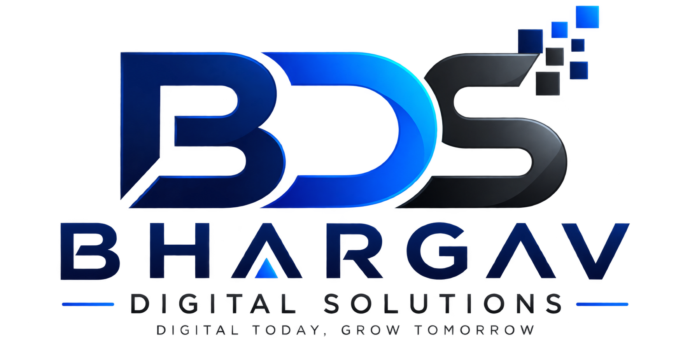

# Bhargav Digital Solutions (BDS) — Official Website

<div align="center">



### **Digital Today, Grow Tomorrow**
*Affordable, High-Impact Digital Marketing Agency in Rajahmundry & Coastal Andhra Pradesh*

[](https://react.dev/)
[](https://www.typescriptlang.org/)
[](https://vitejs.dev/)
[](https://tailwindcss.com/)
[](https://github.com/Hari-bonthu/BDS/actions)
[]()

[Live Website](https://bhargavdigitalsolutions.com/) • [GitHub Pages](https://hari-bonthu.github.io/BDS/) • [Explore Services](#-7-core-dedicated-services) • [Deployment](#-cicd--github-pages-deployment)

</div>

---

## 📌 Overview

**Bhargav Digital Solutions (BDS)** is a premier full-service digital marketing agency headquartered on **Main Road, Danavaipeta, Rajahmundry, Andhra Pradesh**. Built to challenge overpriced metro agencies and ineffective generic freelancers, BDS delivers hyper-local, bilingual (Telugu + English) marketing systems tailored specifically to retail showrooms, healthcare clinics, builders, and service firms across East Godavari and Coastal Andhra.

This repository contains the complete production web application, engineered as a high-performance, single-page application (SPA) with **clean HTML5 history routing (zero hashtag URLs)**, dynamic head metadata synchronization for Google Search Console indexability, Schema.org rich snippets, and automated GitHub Pages deployment.

---

## 🚀 Key Features & Multi-Page Architecture

The platform features an authentic, comprehensive multi-page experience:

### 1. Homepage (`/`)
- **Hero Spotlight**: High-conversion hero with direct WhatsApp integration, free quote trigger, and studio portrait cutout of Founder Bhargav with trust indicators.
- **Key Agency Metrics**: 120+ regional campaigns, 10x average ROAS, 98% retention, and ₹15L+ tracked revenue.
- **Interactive ROI & Budget Estimator**: Dynamic slider estimating monthly reach, qualified lead volume, and ROI based on industry category and ad budget.
- **Google Maps 3-Pack Proof Showcase**: Visual proof of ranking local businesses #1 on Google Maps for high-intent search terms.
- **Hyper-Local Neighborhood Coverage**: Regional chips targeting Danavaipeta, Main Road, Kotipalli, Morampudi, Kambala Tank, Kakinada, Amalapuram, and Mandapeta.
- **Client Case Studies Snapshot**: Verified metrics for regional leaders (*Sri Srinivasa Silks*, *Smile Craft Dental*, *Godavari Meadows*).
- **Founder Story & Philosophy**: Founder Bhargav's hands-on approach and commitment to transparent pricing.

### 2. Services Hub (`/services`) & 7 Dedicated Deep-Dives
Each service has its own dedicated page with bespoke deliverables, 30-day timelines, pricing tiers, FAQs, and case study proofs:
1. **[Short-Form Video & Viral Reel Ads (`/services/short-form-video-ads`)](file:///c:/Users/DELL/Desktop/BDS/BDS_Website/src/pages/ServiceDetailPage.tsx)** — Native Telugu scripting, on-location 4K shooting in Rajahmundry, viral Reels editing, and high-ROAS Meta Ads Manager campaigns.
2. **[Content Creation & Social Design (`/services/content-creation`)](file:///c:/Users/DELL/Desktop/BDS/BDS_Website/src/pages/ServiceDetailPage.tsx)** — Bilingual festival banners, educational carousels, and aesthetic brand creatives starting at ₹4,499/mo.
3. **[100% Hands-Off Social Media Management (`/services/social-media-management`)](file:///c:/Users/DELL/Desktop/BDS/BDS_Website/src/pages/ServiceDetailPage.tsx)** — Daily feed curation, Instagram Stories, local hashtag research, bio optimization, and follower acceleration.
4. **[Platform Coverage & Google Maps Local SEO (`/services/platform-coverage`)](file:///c:/Users/DELL/Desktop/BDS/BDS_Website/src/pages/ServiceDetailPage.tsx)** — Google Business Profile optimization, geo-tagging, citation syncing across 40+ directories, and review collection funnels.
5. **[Content Operations & Cloud Asset Library (`/services/content-operations`)](file:///c:/Users/DELL/Desktop/BDS/BDS_Website/src/pages/ServiceDetailPage.tsx)** — 30-day rolling content calendars, raw 4K footage archiving, and 4-hour emergency turnaround for flash sales.
6. **[Community Management & WhatsApp Triage (`/services/community-management`)](file:///c:/Users/DELL/Desktop/BDS/BDS_Website/src/pages/ServiceDetailPage.tsx)** — Under-15-minute lead qualification, automated WhatsApp routing, and 5-star review collection.
7. **[Reporting & ROI Insights (`/services/reporting-insights`)](file:///c:/Users/DELL/Desktop/BDS/BDS_Website/src/pages/ServiceDetailPage.tsx)** — Plain-English monthly ROI reports tracking ad spend vs. revenue, with monthly 1-on-1 strategy sprints with Founder Bhargav.

### 3. Pricing & Packages (`/pricing`)
- **Tier 1: Starter Presence (₹4,499/mo)** — Ideal for local shops and clinic launches.
- **Tier 2: Growth Accelerator (₹8,999/mo)** — Complete video, social media, and Google Maps package.
- **Tier 3: Market Dominance (₹14,999/mo)** — Full-scale agency partnership with on-site shoots and dedicated management.
- **Interactive Tier Selector & Scope Matrix**: Side-by-side deliverable comparison with month-to-month flexibility and no lock-in contracts.

### 4. Client Results & Case Studies (`/portfolio`)
- Real client performance dashboards featuring verified metrics:
  - **Sri Srinivasa Silks** (Main Road): +180 showroom footfalls in 14 days, 340% festive lift.
  - **Smile Craft Dental** (Danavaipeta): 110+ monthly patient bookings, #1 Google Maps ranking.
  - **Godavari Meadows** (Coastal AP): 240+ verified buyer leads at ₹38/lead, 7 villa bookings.
  - **Sri Lakshmi Interiors**: ₹18.4L in signed high-ticket interior contracts.

### 5. Marketing Insights & Regional Playbooks (`/insights`)
- Editorial knowledge base tailored for Andhra Pradesh business owners:
  - Local SEO & Google Maps playbook for Rajahmundry commercial corridors.
  - Digital marketing pricing guide for Coastal Andhra in 2026.
  - Dental clinic patient acquisition strategies.
  - Saree and jewelry showroom festive Reels formula.
  - Meta Ads vs. Google Ads decision matrix for local shops.
- Filterable by categories: *All Playbooks*, *Local SEO*, *Pricing & ROI*, *Healthcare*, *Retail*, and *Video Ads*.

### 6. About Us & Founder Profile (`/about`)
- In-depth profile of Founder Bhargav and the agency's founding thesis.
- Core operational pillars: Cultural Fluency, Radical Transparency, Speed of Response, and Single-Point Founder Accountability.
- Direct Danavaipeta office details and working hours.

### 7. Contact & Free Growth Plan Consultation (`/contact`)
- Interactive strategy booking form with automated WhatsApp message formatting.
- Direct phone dial, office coordinates, and Google Maps embed directions.
- Universal **Quote Modal** accessible from any page with service pre-selection and confetti celebration.

---

## 🔍 SEO & Search Console Architecture

To ensure 100% crawlability and optimal ranking on Google Search Console:

1. **Clean Path URLs (Zero Hashtags)**:
   - All navigation uses the **HTML5 History API (`window.history.pushState` / `popstate`)**.
   - Clean, standard URLs (`/about`, `/portfolio`, `/pricing`, `/services/content-creation`) replace legacy hash routes (`/#about`, `/#portfolio`).
   - Prevents Google Search Console from dropping fragment identifiers or treating the entire website as a single page.

2. **Automatic Legacy Hash Migration**:
   - If a visitor or backlink enters via a legacy hashtag (`/#portfolio`, `/#about`, or `/#/services`), client-side detection automatically resolves the route, cleans the URL via `window.history.replaceState`, and seamlessly presents the page.

3. **Dynamic Metadata & Social Previews**:
   - `document.title`, `meta[name="description"]`, `link[rel="canonical"]`, and OpenGraph/Twitter tags dynamically synchronize on every page transition.

4. **Schema.org Structured Data**:
   - Injected in `index.html` with JSON-LD graphs for:
     - `ProfessionalService` & `LocalBusiness` (Geo-coordinates, opening hours, area served, telephone, address)
     - `AggregateRating` & Client `Review` items
     - `OfferCatalog` detailing the agency's primary service offerings
     - `FAQPage` with rich snippet answers for regional voice search

5. **Sitemaps & Robots**:
   - [`public/sitemap.xml`](file:///c:/Users/DELL/Desktop/BDS/BDS_Website/public/sitemap.xml): Covers all main pages, 7 dedicated service paths, and key commercial neighborhood landing URLs.
   - [`public/robots.txt`](file:///c:/Users/DELL/Desktop/BDS/BDS_Website/public/robots.txt): Configured for full indexing with explicit sitemap declaration.

---

## 🛠️ Technology Stack

| Category | Technology | Description |
| :--- | :--- | :--- |
| **Framework** | [React 19](https://react.dev/) | Core UI library with modern hooks and concurrent rendering |
| **Language** | [TypeScript 5.8](https://www.typescriptlang.org/) | Strict type safety and clear domain definitions |
| **Build Tool** | [Vite 6.2](https://vitejs.dev/) | Next-generation frontend tooling with lightning-fast HMR and bundling |
| **Styling** | [Tailwind CSS 4.1](https://tailwindcss.com/) | Modern utility-first CSS framework using `@tailwindcss/vite` |
| **Animations** | [Motion 12](https://motion.dev/) | Smooth layout transitions, reveal effects, and interactive UI states |
| **Icons** | [Lucide React](https://lucide.dev/) | Lightweight, customizable SVG icon system |
| **Effects** | [Canvas Confetti](https://www.npmjs.com/package/canvas-confetti) | Visual confirmation for successful quote submissions |
| **CI/CD** | [GitHub Actions](https://github.com/features/actions) | Automated build and deployment to GitHub Pages |

---

## 📁 Project Directory Structure

```text
BDS_Website/
├── .github/
│   └── workflows/
│       └── deploy.yml              # GitHub Actions Pages deployment pipeline
├── public/
│   ├── assets/                     # High-DPI logos, campaign visuals, team photos
│   ├── 404.html                    # SPA clean-path redirector for GitHub Pages
│   ├── favicon.svg                 # Brand favicon
│   ├── robots.txt                  # Search crawler directives
│   └── sitemap.xml                 # XML sitemap with all clean canonical URLs
├── src/
│   ├── components/
│   │   └── common/
│   │       ├── BDSLogo.tsx          # Responsive vector brand mark
│   │       ├── FloatingQuickActions.tsx # WhatsApp & Call floating triggers
│   │       ├── Footer.tsx           # Agency footer with navigation and office details
│   │       ├── FounderPortrait.tsx  # Studio portrait cutout component
│   │       ├── Navbar.tsx           # Header with services dropdown & language switch
│   │       ├── PlatformLogos.tsx    # Branded platform SVG icons
│   │       └── QuoteModal.tsx       # Interactive lead capture modal with confetti
│   ├── data/
│   │   ├── companyData.ts          # Office details, phone numbers, contact info
│   │   ├── insightsData.ts         # Articles, playbooks, and SEO guides
│   │   └── servicesData.ts         # Specifications for all 7 growth services
│   ├── pages/
│   │   ├── AboutPage.tsx           # Founder story, ethos, and team
│   │   ├── ContactPage.tsx         # Direct contact forms and maps
│   │   ├── HomePage.tsx            # High-conversion primary landing page
│   │   ├── InsightsPage.tsx        # Filterable marketing playbooks
│   │   ├── PortfolioPage.tsx       # Verified case studies & client results
│   │   ├── PricingPage.tsx         # Regional package pricing & comparison
│   │   ├── ServiceDetailPage.tsx   # Deep-dive view for 7 dedicated services
│   │   └── ServicesPage.tsx        # Overview matrix of all services
│   ├── utils/
│   │   └── asset.ts                # Asset path helper handling root and subpaths
│   ├── App.tsx                     # History-based SPA router & head metadata manager
│   ├── index.css                   # Tailwind CSS imports and custom design utilities
│   ├── main.tsx                    # React application entry point
│   ├── types.ts                    # TypeScript types and PageId declarations
│   └── vite-env.d.ts               # Vite client type definitions
├── index.html                      # HTML entry with Schema.org & SPA path decoder
├── package.json                    # Project dependencies and npm scripts
├── tsconfig.json                   # TypeScript compiler configuration
└── vite.config.ts                  # Vite config with dynamic base URL support
```

---

## 💻 Local Development

### Prerequisites
- [Node.js](https://nodejs.org/) (version 20.x or higher recommended)
- `npm` (bundled with Node.js)

### Installation & Setup

1. **Clone the Repository**:
   ```bash
   git clone https://github.com/Hari-bonthu/BDS.git
   cd BDS/BDS_Website
   ```

2. **Install Dependencies**:
   ```bash
   npm install
   ```

3. **Start the Local Development Server**:
   ```bash
   npm run dev
   ```
   Open your browser at `http://localhost:5173/` to view the site with Hot Module Replacement (HMR).

4. **Verify TypeScript Types**:
   ```bash
   npm run lint
   ```

5. **Build for Production**:
   ```bash
   npm run build
   ```
   Compiles the TypeScript codebase and outputs the minified static build to `dist/`.

6. **Preview Production Build Locally**:
   ```bash
   npm run preview
   ```
   Launches Vite's local preview server at `http://localhost:4173/`.

---

## 🌐 CI/CD & GitHub Pages Deployment

The repository is equipped with an automated, production-grade deployment workflow: [`.github/workflows/deploy.yml`](file:///c:/Users/DELL/Desktop/BDS/BDS_Website/.github/workflows/deploy.yml).

### How It Works:
1. **Push Trigger**: Any push to the `main` branch (or manual `workflow_dispatch`) automatically triggers the pipeline.
2. **Dynamic Base Path Configuration**:
   - The workflow uses `actions/configure-pages@v5` to detect the repository environment (`/BDS` on GitHub Pages or `/` on a custom domain).
   - [`vite.config.ts`](file:///c:/Users/DELL/Desktop/BDS/BDS_Website/vite.config.ts) dynamically injects this path during `npm run build`.
3. **Artifact Deployment**:
   - `actions/upload-pages-artifact@v3` packages the `dist/` directory.
   - `actions/deploy-pages@v4` publishes the application directly to GitHub Pages.
4. **Clean SPA Direct Navigation**:
   - Direct visits or refreshes on nested paths (e.g. `/services/short-form-video-ads`) are caught by [`public/404.html`](file:///c:/Users/DELL/Desktop/BDS/BDS_Website/public/404.html), passed to `index.html` via query string, and restored cleanly by the SPA script via `window.history.replaceState` — ensuring no broken pages and no hashtag pollution.

### Activating GitHub Pages in Your Repository:
1. Navigate to: `https://github.com/Hari-bonthu/BDS/settings/pages`
2. Under **Build and deployment** > **Source**, select **GitHub Actions**.
3. Push to `main` — your live site will be deployed at:
   **`https://hari-bonthu.github.io/BDS/`** (or your configured custom domain `https://bhargavdigitalsolutions.com/`).

---

## 📞 Business Information & Contact

- **Agency**: Bhargav Digital Solutions (BDS)
- **Headquarters**: Main Road, Danavaipeta, Rajahmundry, East Godavari, AP - 533103
- **Founder**: Bhargav (Lead Digital Growth Strategist)
- **Direct Phone**: [+91 97043 80535](tel:+919704380535)
- **WhatsApp**: [+91 97043 80535](https://wa.me/919704380535)
- **Email**: [bhargavdigitalsolutions@gmail.com](mailto:bhargavdigitalsolutions@gmail.com)
- **Working Hours**: Mon–Sat: 9:00 AM – 7:30 PM IST (Sunday by Appointment)

---

## 📄 License

Proprietary © 2026 **Bhargav Digital Solutions (BDS)**. All rights reserved.
Unauthorized copying, duplication, or distribution of this code, design assets, or media is strictly prohibited.
